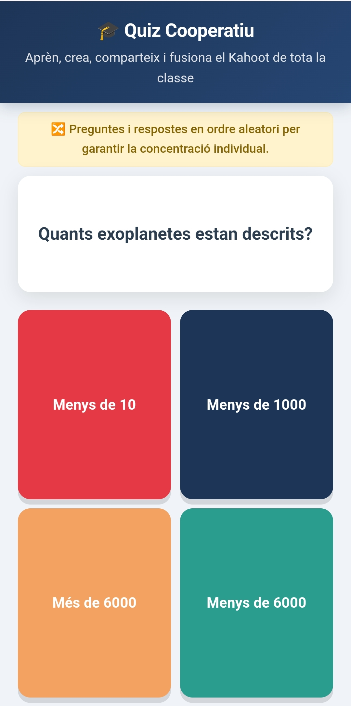
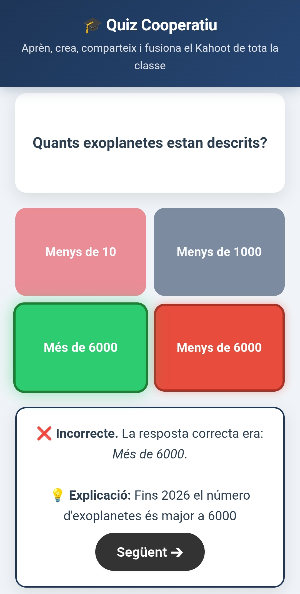
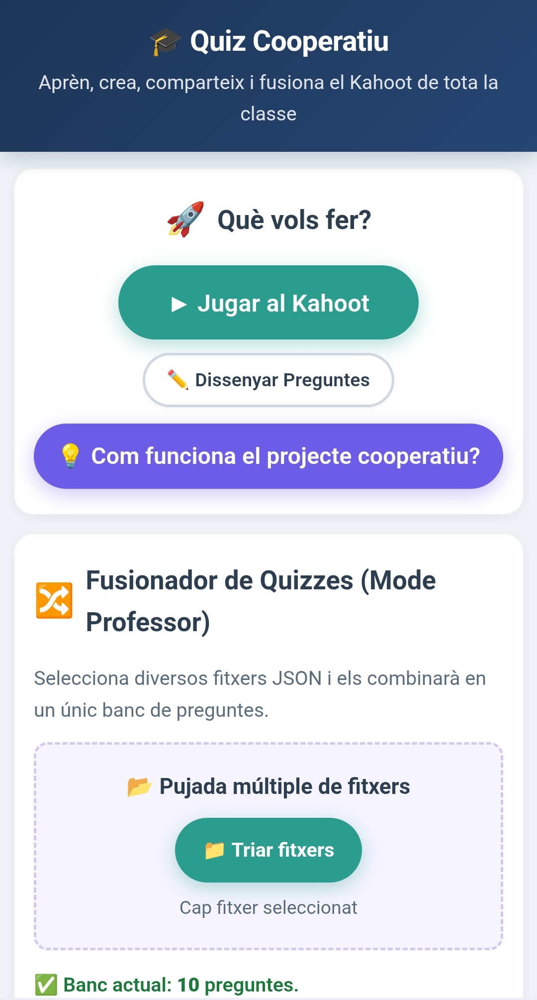
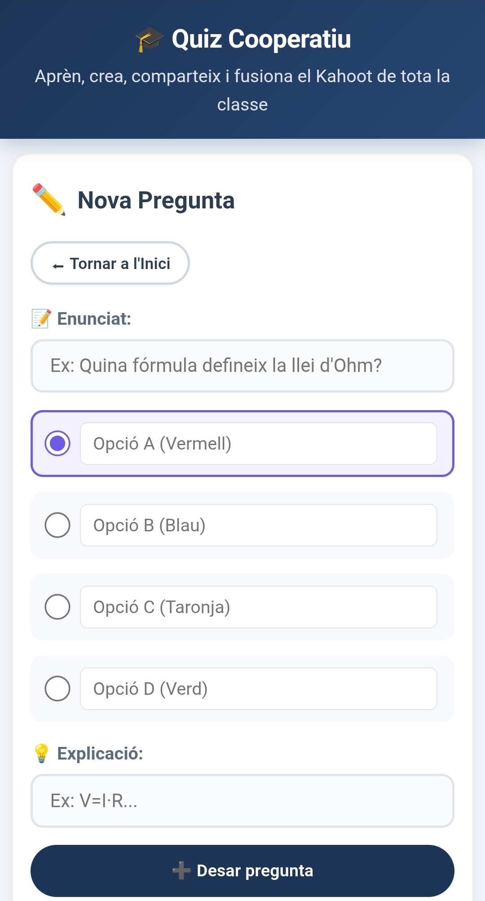

# 🎓 Quiz Cooperatiu – Crea el teu Kahoot de Classe

Eina web interactiva per dissenyar, compartir i fusionar qüestionaris educatius.  
Pensada per a l'aprenentatge cooperatiu: **cada alumne crea les seves preguntes, les exporta en JSON, i el professor les fusiona totes** per generar un únic Kahoot de repàs col·lectiu.


---

## 🚀 Característiques principals

- ✏️ **Disseny de preguntes** amb 4 opcions, resposta correcta i explicació teòrica.
- 📥 **Exportació i importació** de preguntes en format JSON (qualsevol extensió permesa).
- 🔀 **Fusionador intel·ligent** per combinar múltiples fitxers JSON en un sol banc.
- 🎮 **Joc de Kahoot** completament funcional en una sola pantalla.
- 🔀 **Barreja aleatòria** de preguntes i respostes (Fisher-Yates) per evitar còpies.
- 📱 **Disseny responsiu** adaptat a mòbil, tauleta i PC.
- 💾 **Emmagatzematge local** (`localStorage`) per conservar les preguntes entre sessions.
- 🧑‍🏫 **Modal d'instruccions** integrat per guiar alumnes i professors.

---

## 📸 Captures de pantalla







| Pantalla principal | Editor de preguntes | Joc en marxa |
|-------------------|---------------------|--------------|
| *(Menú amb botons: Jugar, Dissenyar, Fusionar, Exportar, Esborrar)* | *(Formulari amb camps de text, opcions i explicació)* | *(Quadrícula de 4 respostes de colors, feedback immediat)* |

| Fusionador de fitxers | Resultat final |
|-----------------------|----------------|
| *(Botó per triar fitxers, barra d'estat, descàrrega combinada)* | *(Encerts, percentatge, llista d'errors)* |

---

## 🧑‍🎓👨‍🏫 Com s'utilitza

### Per a l'alumne

1. Obre l'aplicació i ves a **Dissenyar Preguntes**.
2. Crea cada pregunta amb les 4 opcions, marca la correcta i escriu una explicació.
3. Torna al menú principal i prem **Exportar el meu banc**.
4. Envia el fitxer `.json` descarregat al professor.

### Per al professor

1. Recopila tots els fitxers `.json` dels alumnes.
2. Ves a la secció **Fusionador de Quizzes**.
3. Clica **Triar fitxers** i selecciona'ls tots alhora.
4. Prem **Descarregar Tot Fusionat** per obtenir el fitxer final.
5. Ara ja pots prémer **Jugar al Kahoot** amb totes les preguntes de la classe.

💡 *El mateix fitxer fusionat es pot tornar a pujar en un altre ordinador per continuar editant o jugant.*

---

## 🛠️ Tecnologies utilitzades

- **HTML5** – estructura semàntica i accessibilitat.
- **CSS3** – variables, flexbox, grid, animacions i disseny responsiu.
- **JavaScript (ES6)** – lògica del joc, gestió de `localStorage`, importació/exportació JSON i algorisme de Fisher-Yates.
- **Cap dependència externa** – tot el codi és autònom i s'executa directament al navegador.

---

## 📂 Estructura del projecte

```text
kahoot-cooperatiu/
├── index.html         # Fitxer únic amb tot l'HTML, CSS i JS incrustat
├── README.md          # Aquest document
└── exemple.json       # Exemple de fitxer de preguntes exportat
```

---

## 📄 Format del JSON

Cada pregunta es guarda en un array amb el següent objecte:

```json
[
  {
    "text": "Quina és la capital de França?",
    "options": ["París", "Londres", "Berlín", "Madrid"],
    "correct": 0,
    "explanation": "París és la capital de França des del segle III."
  }
]
```

El fusionador accepta tant arrays directes com objectes amb la clau `questions`:

```json
{
  "questions": [
    {
      "text": "Quina és la capital de França?",
      "options": ["París", "Londres", "Berlín", "Madrid"],
      "correct": 0,
      "explanation": "París és la capital de França des del segle III."
    }
  ]
}
```

---

## ⚙️ Instal·lació i execució

1. Descarrega el fitxer `index.html`.
2. Obre'l amb qualsevol navegador modern (Chrome, Firefox, Edge, Safari).
3. Comença a crear preguntes o importa un fitxer JSON.
4. Les dades es guarden automàticament al `localStorage` del navegador.

🔁 Per desplegar-lo en línia, pots pujar el fitxer a **GitHub Pages**, **Netlify**, **Vercel** o qualsevol servidor estàtic.

---

### Prova el joc inicial

Pots provar la versió inicial del joc en aquest enllaç:

👉 https://drfperez.github.io/kahoot

## 🔒 Privacitat i dades

- Totes les preguntes es guarden exclusivament al dispositiu local (`localStorage` del navegador).
- No s'envia cap dada a servidors externs.
- Per netejar les dades, prem el botó **Esborrar tot el banc** al menú principal.

---

## 🤝 Contribuir

Les contribucions són benvingudes! Si tens idees per millorar l'eina:

1. Fes un **fork** del repositori.
2. Crea una branca amb la teva funcionalitat:

```bash
git checkout -b millora/nova-funcio
```

3. Fes **commit** dels canvis:

```bash
git commit -m "Afegeix X funcionalitat"
```

4. Puja la branca:

```bash
git push origin millora/nova-funcio
```

5. Obre un **Pull Request**.

Si trobes cap error, pots obrir un **issue**.

---

## 📝 Llicència

Aquest projecte està sota la llicència **MIT**.  
Pots utilitzar-lo, modificar-lo i distribuir-lo lliurement, mantenint l'avís de copyright.

---

## 🙏 Crèdits

Desenvolupat amb ❤️ per **Francesc Pérez**  
Inspirat en la dinàmica de Kahoot i l'aprenentatge cooperatiu a l'aula.

---

## 🎉 Nota final

Gaudeix creant i jugant amb la teva classe!
